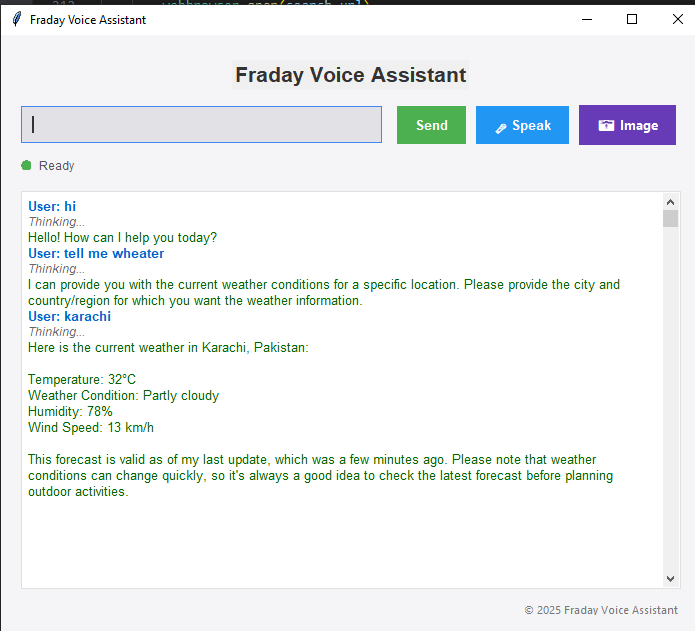
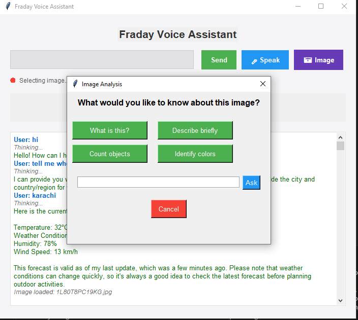

# 🤖Fraday - AI Voice Assistant

**Fraday** is an advanced multimodal AI-powered voice assistant built with Python. It uses **Cohere**, **Gemini (Google Generative AI)**, **OpenWeather**, **News API**, and supports both **text and voice commands**. Designed with a modern **Tkinter GUI**, it can perform various tasks like answering questions, analyzing images, sending emails, playing music/videos, checking weather, news, and more.
## 🧠 Features

- 🎙️ Voice and Text Interaction
- 🤖 ChatGPT-like AI Chat (Cohere + Gemini)
- 🖼️ Image Classification and Description using Google Gemini
- 🗓️ Time, Date, Weather, and News Updates
- 📧 Send Emails and WhatsApp Messages
- 🔎 Smart Google Search
- 🎵 Play Music & YouTube Videos
- 🧮 Math Calculations
- 📂 Application Launcher (Notepad, CMD, Word, Excel, Games, etc.)
- 💬 Chat history with assistant
- 🖥️ Beautiful and responsive Tkinter GUI
## 📁 Folder Structure

```bash
Fraday-Voice-Assistant/
├── main.py                  # Main app file (your code goes here)
├── api.py                   # API keys (Cohere, Gemini, Weather, News, Email)
├── README.md
├── requirements.txt
```
## 🔧 Setup Instructions

### 1. Clone Repository
```bash
git clone https://github.com/yourusername/Fraday-Voice-Assistant.git
cd Fraday-Voice-Assistant
```

### 2. Install Dependencies
```bash
pip install -r requirements.txt
```

### 3. Create `api.py`
Create an `api.py` file in the root directory with your API keys:
```python
cohere_key = "your-cohere-api-key"
genai = "your-gemini-api-key"
weather = "your-openweather-api-key"
news = "your-newsapi-key"
email = "your-email@gmail.com"
password = "your-email-password"
```

> **Note:** You can use [App Passwords](https://support.google.com/accounts/answer/185833) for Gmail.

### 4. Run the Assistant
```bash
python main.py
```

## 🖼️ GUI Preview

### GUI


### Image GUI

## 🔑 Tech Stack

- **Python 3.8+**
- **Tkinter** - GUI
- **Cohere** - Chat AI
- **Gemini 1.5** - Image analysis
- **gTTS + pyttsx3** - Text-to-Speech
- **SpeechRecognition** - Voice input
- **OpenWeather + NewsAPI** - External data
- **Pillow** - Image display
## ✅ To-Do Enhancements

- [ ] Add chatbot memory persistence
- [ ] Add multilingual support
- [ ] Add user login for personalized experience
- [ ] Package as `.exe` for Windows
- [ ] Make it more optimizable and correct
- [ ] Fix all bugs
## 🤝 Contributing

Pull requests are welcome! For major changes, open an issue first to discuss what you would like to change.
## License 📜
This project is open source and available under the [MIT](https://choosealicense.com/licenses/mit/)


## 💬 Contact

**Developer**: Faaiz Ahmed

**Email**: 2005faaiz@example.com

**GitHub**: [github.com/faaiz-ahmed](https://github.com/faaiz-ahmed)

> If you like this project, ⭐️ star the repo and share it!
